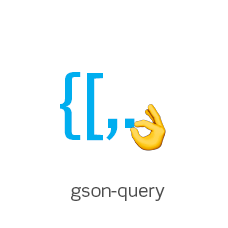

<h1 align="left"></h1>

**Query and transform your json data using an extended glob-pattern within browsers or nodejs**

> Query and transform your json data using an extended glob-pattern. This is a really helpful tool to quickly
>
> - fuzzy search json-data matching some search properties
> - transform data with consistent structures
> - extract information from json-data

`npm install gson-query --save`

and get it like

`const query = require("gson-query");`

The command-line integration can be installed separately by [gson-query-cli](https://github.com/sagold/gson-query-cli)


- [Introduction](#quick-introduction)
- [API](#api)
  - [query](#query)
  - [callback](#callback)
  - [query.run](#query.run)
  - [query.get](#query.get)
  - [query.delete](#query.delete)
  - [query.pattern](#query.pattern)
- [Further examples](#further-examples)

## Breaking Changes

- with `v2.0.0` a negated filter (lookahead), e.g. `*?valid:!true` will not return objects where `valid === undefined`. To match objects with missing properties you can still query them explicitly with `*?valid:!true||valid:undefined`


## Quick introduction

**run** a callback-function on each match of your _query_

```js
query.run(data, "/server/*/services/*", callback);
```

a **callback** receives the following arguments

```js
/**
 * @param {Any} value              - value of the matching query
 * @param {String} key             - the property or index of the value
 * @param {Object|Array} parent    - parent[key] === value
 * @param {String} jsonPointer     - json-pointer in data, pointing to value
 */
function callback(value, key, parent, jsonPointer) => { /* do sth */ }
```

**get** matches in an array instead of running a callback

```js
let results = query.get(data, "/server/*?state:critical", query.get.VALUE); // or POINTER or ALL
```

which is the same as

```js
let results = query.get(data, "/server/*/services/*", (value) => value);
```

or quickly **delete** properties from your data

```js
query.delete(data, "/server/*/services/{szm-.*}");
```

Use **patterns** to query patterns recursively

```js
query.pattern(data, "/node(/nodes/*)+/value");
```

and to select multiple properties of an object or array:
```js
query.pattern(data, "/server((/store), (/{front-.*}))/services/*");
```


## API

All examples import `const query = require("gson-query");`

### query

At first, **json-query** acts like a normal [**json-pointer**](https://github.com/sagold/json-pointer)

```js
let data = {
  "parent": {
    "child": { "id": "child-1" }
  }
};
const result = query.get(data, "#/parent/child/id", query.get.VALUE);
// result:
[
  "child-1"
]
```

But query also supports **glob-patterns** with `*`:

```js
let data = {
  "parent": {
    "child": { "id": "child-1" }
  },
  "neighbour": {
    "child": { "id": "child-2" }
  }
};
const result = query.get(data, "#/*/child/id", query.get.VALUE);
// result:
[
  "child-1",
  "child-2"
]
```

and **glob-patterns** with `**`:

```js
let data = {
  "parent": {
    "id": "parent",
    "child": {"id": "child-1"}
  },
  "neighbour": {
    "child": {"id": "child-2"}
  }
};
const result = query.get(data, "#/**/id", query.get.VALUE);
// result:
[
  "parent",
  "child-1",
  "child-2"
]
```

or simply call `query.get(data, "#/**", query.get.VALUE)` to query the value of each property

```js
let data = {
  "parent": {
    "id": "parent",
    "child": { "id": "child-1" }
  }
};
const result = query.get(data, "#/**/id", query.get.VALUE);
// result:
[
  {
    "id":"parent",
    "child": { "id":"child-1" }
  },
  "parent",
  { "id":"child-1" },
  "child-1"
]
```

To **filter** the matched objects, an object-query string may be appended on each single step:

```js
let data = {
  "parent": {
    "valid": true,
    "child": {"id": "child-1"}
  },
  "neighbour": {
    "valid": false,
    "child": {"id": "child-2"}
  },
  "dungeons": {
    "child": {"id": "child-3"}
  }
};
let result = query.get(data, "#/**?valid:true&&ignore:undefined/child", query.get.VALUE);
// same result with
result = query.get(data, "#/**?valid:!false/child", query.get.VALUE);
// result:
[
  {
    "valid": true,
    "child": {"id": "child-1"}
  }
]
```

or match all objects that have a defined property _valid_ like `query.run(data, "#/**?valid", callback)`.

```js
let data = {
  "parent": {
    "valid": true,
    "child": {"id": "child-1"}
  },
  "neighbour": {
    "valid": false,
    "child": {"id": "child-2"}
  },
  "dungeons": {
    "child": {"id": "child-3"}
  }
};
const result = query.get(data, "#/**?valid", query.get.VALUE);
// result:
[
  {
    "valid": true,
    "child": {
      "id": "child-1"
    }
  },
  {
    "valid": false,
    "child": {
      "id": "child-2"
    }
  }
]
```

**regular expression** must be wrapped with `{.*}`:

```js
let data = {
  "albert": {valid: true},
  "alfred": {valid: false},
  "alfons": {valid: true}
};
const result = query.get(data, "#/{al[^b]}?valid:true", query.get.POINTER);
// result:
[
  "#/alfred"
]
```


### query.run

If you want a callback on each match use `query.run(data:object|array, query:string, callback:function):void`

```js
query.run(data, "#/**/*?valid", (value, key, parent, jsonPointer) => {});
```


### callback

Each **callback** has the following signature
`callback(value:any, key:string, parent:object|array, jsonPointer:string)`

```js
/**
 * @param {Any} value              - value of the matching query
 * @param {String} key             - the property or index of the value
 * @param {Object|Array} parent    - parent[key] === value
 * @param {String} jsonPointer     - json-pointer in data, pointing to value
 */
function callback(value, key, parent, jsonPointer) => { /* do sth */ }
```


### query.get

If you only require values or pointers, use `query.get(data:object|array, query:string, type:TYPE = "all")` to receive an Array or Object as result

```js
// default: query.get.VALUES
let arrayOfValues = query.get(data, "#/**/id", query.get.VALUE);
// result: [value, value]

let arrayOfJsonPointers = query.get(data, "#/**/id", query.get.POINTER);
// result: ["#/..", "#/..", ...]

let arrayOfAllFourArguments = query.get(data, "#/**/id", query.get.ALL);
// result: [arguments, arguments], where arguments = 0:value 1:object 2:key 3:jsonPointer

let mapOfPointersAndData = query.get(data, "#/**/id", query.get.MAP);
// result: {"#/..": value, "#/..": value}

let mapOfPointersAndData = query.get(data, "#/**/id", (val, key, parent, pointer) => `custom-${pointer}`);
// result: ["custom-#/parent/child/id", "custom-#/neighbour/child/id", "custom-#/dungeons/child/id"]
```


### query.delete

Multiple items on objects or in arrays may also be delete with `query.delete(data:object|array, query:string):void`:

```js
query.delete(data, "#/**/*/data");
```


### query.pattern

The pattern-queries behave as the default `query.get` methods:

```js
import query from "gson-query";

// predefined callback
const targets = query.pattern(data, "#/*(/node/*?valid)+/valid", query.get.POINTER); // return pointers
const values = query.pattern(data, "#/*(/node/*?valid)+/valid", query.get.VALUES); // return values
// ...
// custom callback
query.pattern(data, "#/*(/node/*?valid)+/valid", (value, key, parent, jsonPointer) => {});
```

Pattern-queries enable selection of recursive patterns and offer a way to build up a collection of data for further filterung. A pattern uses brackets `()` to identify repeatable structures and offers multiple selections for the same data-entry.

Using a pattern-query like `#/tree((/left),(/right))*` will recursively select all *left* and *right*-nodes. e.g.

```js
const data = {
  tree: {
    left: {
      id: "1",
      left: { id: "2" },
      right: { id: "3" }
    },
    right: {
      id: "4"
    }
  }
};

const result = query.pattern(data, "#/tree((/left),(/right))*/id");
// ["1", "2", "3", "4"]
```

**Note** that each pattern-queries are resovled using `query.get` and thus support all mentioned features.

One use-case for pattern-queries can be found in json-schema specification. Any definition in `#/defs` may reference itself or be referenced circular. A linear query cannot describe the corresponding data, but pattern-queries might be sufficient.


#### details

A pattern is a simple group defined by brackets: `#/a(/b)/c`, which is identical to `#/a/b/c`. But a group may also have a quantifier `+`: `#/a(/b)+/c`. Using a quantifier, the query within the pattern will be applied as long as it matches any data. Its combined result will then be passed to `/c`.

e.g. applying the pattern `#/a(/b)+/c` on the following input data:

```js
const input = {
  a: {
    b: {
      c: "1",
      b: {
        c: "2",
        b: {}
      }
    }
  }
};
```

will first select property `a` and then repeatedly select property `b`: `[a/b, a/b/b, a/b/b/b]`. This result is filtered by `c`, which will return `["1", "2"]` (the last `b`-object has no property `c`).

Patterns can also be used for **OR**-operations. An *OR* is identified by a semicolon `,` and must be within and between patterns, like `((/a/b),(/c))`. **Not valid** patterns are *(/a/b, /c)* and *r/(/a/b),(/c)/f*.

Currently, using **OR** is *commutative* in a sense that `((/a),(/b)) = ((/b),(/a))`, (with a different ordering of the resulting set), *distributive* so that `/a((/b), (/c)) = ((/a/b), (/a/c))`. **Parenthesis** without a quantifier are *associative*, e.g. `#/a/b/c = #/a(/b)/c = #/a(/b/c) = #/a(/b)(/c)`. Thus, a pattern `((/b)(/c))+` can also be written like `(/b/c)+`.


## further examples

for further examples refer to the unit tests

- [query.delete](https://github.com/sagold/json-query/blob/master/test/unit/queryDelete.test.js)
- [query.get](https://github.com/sagold/json-query/blob/master/test/unit/queryGet.test.js)
- [query.query](https://github.com/sagold/json-query/blob/master/test/unit/query.test.js)
- [query.pattern](https://github.com/sagold/json-query/blob/master/test/unit/pattern.test.js)
